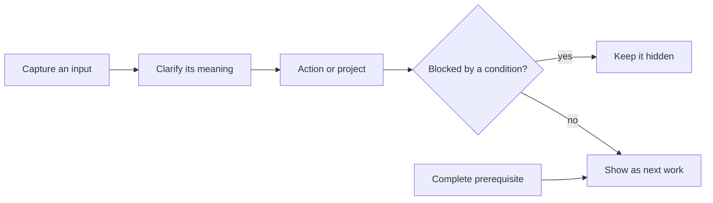

# GTD Engine

GTD Engine gives a person and their AI assistants one shared record of tasks.
GTD means **Getting Things Done**: capture what has your attention, clarify what
it means, and show only work that can actually move. An external store matters when an AI chat
session ends: the task state, its dependencies, and the reason it exists remain available to the
next person or assistant. It avoids task lists spread across notes and scripts that disagree about
whether something is open, blocked, or complete.

Here is the ordinary problem it addresses. You write: “draft the launch checklist.” That is a
capture, not yet a commitment. After you clarify it, it becomes an action. “Review the launch
checklist” depends on the draft, so it stays out of the next-action list. When the draft is
completed, the engine updates that dependency in the same database transaction and the review
becomes available. This showcase runs that exact scenario.

## How the full system works



I built the private system around SQLite as the source of truth and one shared CLI for validation,
transactions, history, and queries. “Next” is calculated from current state; it
is never a label that can drift from reality. Dependencies are typed conditions such as another
action being done or a date being reached. Each blocked action stores its own prerequisite,
so the reason it is waiting can be inspected directly.

The broader system also projects selected views into notes. That projection is one way: authored
text stays authored text, while an edit in a generated region is treated as new input to capture.
Scheduled work can prepare a review surface, but it does not make commitment decisions for the
operator. Those choices keep automated assistance useful while preserving a clear human decision
about what becomes a commitment.

## Run the public demonstration

Requires Python 3.12 or newer and no packages beyond the standard library.

```sh
python gtd_showcase.py run
python gtd_showcase.py invalid-state
python tests/test_demo.py
```

The first command prints JSON containing `"blocked_before_completion": true`, then shows
`"Review the launch checklist"` as the next action after completion. The second prints a
rejection for the invalid commitment type `urgent`. The tests exercise capture, clarification,
dependency propagation, invalid state validation, and a simulated journal-write failure.

The demo creates a temporary SQLite file and removes it before exit. It makes no network calls.

## Code guide

`gtd/migrations.py` defines the checked SQLite schema. `gtd/mutations.py` contains the capture,
clarification, action, dependency, and completion transitions. `gtd/predicates.py` evaluates
conditions, while `gtd/queries.py` computes next actions. `gtd_showcase.py` supplies the
synthetic scenario and ensures it loads this candidate’s code.

This is a focused engineering sample, not the full operating system. It leaves out the private
command surface, note projection, calendar input, automation queue, backups, configuration, and
user data. `SOURCE_PROVENANCE.json` records hashes for the reviewed source transformations used
to prepare this public copy.

## License and maintenance

MIT Copyright 2026 John. This project does not accept external contributions. Forking and reuse
under the license are welcome.
