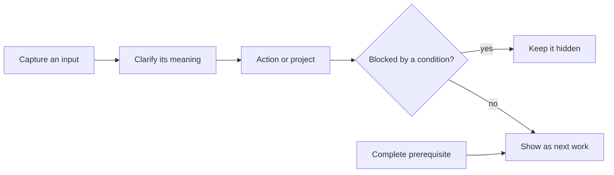

# GTD Engine

GTD Engine gives a person and their AI assistants one shared record of tasks.
GTD means **Getting Things Done**: capture what has your attention, clarify what
it means, and show only work that can actually move. An external store matters when an AI chat
session ends: the task state, its dependencies, and the reason it exists remain available to the
next person or assistant. It avoids task lists spread across notes and scripts that disagree about
whether something is open, blocked, or complete.

Here is the ordinary problem it addresses. You write: “draft the launch checklist.” That is a
capture, not yet a commitment. After you clarify it, it becomes an action. “Review the launch
checklist” depends on the draft, so it stays out of the next-action list. When the draft is
completed, the engine updates that dependency in the same database transaction and the review
becomes available. The commands below run that workflow with persistent local state.

## How the full system works



I built the private system around SQLite as the source of truth and one shared CLI for validation,
transactions, history, and queries. “Next” is calculated from current state; it
is never a label that can drift from reality. Dependencies are typed conditions such as another
action being done or a date being reached. Each blocked action stores its own prerequisite,
so the reason it is waiting can be inspected directly.

The broader system also projects selected views into notes. That projection is one way: authored
text stays authored text, while an edit in a generated region is treated as new input to capture.
Scheduled work can prepare a review surface, but it does not make commitment decisions for the
operator. Those choices keep automated assistance useful while preserving a clear human decision
about what becomes a commitment.

## Install and use it

Requires Python 3.12 or newer. Runtime uses only the standard library. Installation requires pip and setuptools; pip may download build tooling.

```sh
git clone https://github.com/kn0wsnothing/gtd-engine-showcase.git
cd gtd-engine-showcase
python -m venv .venv
.venv/bin/pip install .
.venv/bin/gtd init
.venv/bin/gtd capture "Draft the launch checklist"
.venv/bin/gtd clarify 1 --as action --text "Draft the launch checklist"
.venv/bin/gtd action add "Review the launch checklist" --after 1
.venv/bin/gtd blocked
.venv/bin/gtd done 1
.venv/bin/gtd next
.venv/bin/gtd history
```

Daily changes use the same local record. `gtd action drop ID --reason "..."` closes an action with its reason. `gtd action reopen ID` restores it and rechecks dependent actions. `gtd action someday ID` (or `park`) removes it from the active lists until `reactivate`. `gtd action defer ID --until YYYY-MM-DD` adds a date block; `undelay` removes that action's date blocks. Both changes appear in local history. Use `gtd action edit ID --text "..." --reason "..."` for a corrected action label. The edit is recorded in the audit trail. `--force` is available only with a stated reason when a recent edit changes the leading verb. `gtd project list` shows projects and their active counts. Use `gtd project actions ID` to see its child actions. `gtd project close ID --state done` or `dropped` refuses to hide open or someday children: finish, drop, or reassign them first.

The database defaults to `~/.local/share/gtd-engine/gtd.db`. History is stored at
`GTD_HOME/history.jsonl`, even when `GTD_DB` selects a different database directory. Set `GTD_HOME`
for another data directory or `GTD_DB` for an exact database path. `init` only creates or migrates the
database. It never resets it. Use `gtd project add "Launch is ready"` and `gtd action add ...
--project ID` to organize actions, `gtd inbox` to inspect captures, `gtd show action ID` to inspect
a record, and `gtd --json` for structured output.

The commands above persist across separate invocations. `blocked` shows the review action before
its prerequisite completes; after `done 1`, `next` shows it. `history` reads the append-only local
record of captures, clarifications, direct additions, and closures. The application makes no
network calls. SQLite is authoritative. If the separate history append fails after a change,
the command still returns success and prints the result plus a warning on stderr. Do not repeat
that mutation: it is saved in the database. The history entry will be missing.

## Code guide

`gtd/migrations.py` defines the checked SQLite schema. `gtd/mutations.py` contains the capture,
clarification, action, dependency, and completion transitions. `gtd/predicates.py` evaluates
conditions, while `gtd/queries.py` computes next actions. `gtd/cli.py` is the public command-line
application. `gtd/journal.py` writes the local durable history.

This public application covers personal task capture, clarification, projects, actions,
dependencies, completion, and history. It deliberately leaves out the private note projection,
calendar input, automation queue, backups, and integrations. `SOURCE_PROVENANCE.json` records
hashes for the reviewed source transformations used to prepare this public copy.

## License and maintenance

MIT Copyright 2026 John. This project does not accept external contributions. Forking and reuse
under the license are welcome.
